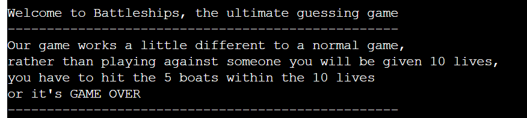
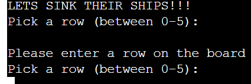
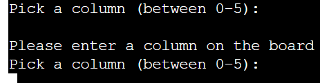
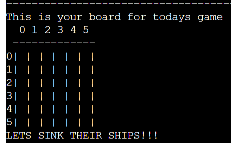
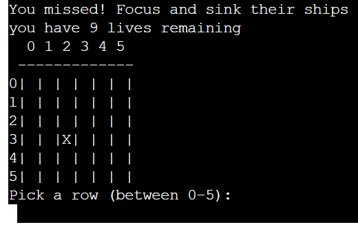
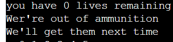

# Battleships

Link to deployed game is available at - [battleships game](https://battleships-game-2024-1746bf9acf31.herokuapp.com/)
## Introduction
Battle ships is a strategy guessing game, played on a grid that scores players based on how many targets they manage to guess the location of. Typically an online battleships game is played against either a computer or another player, but my version of battleships is played differen in which players are still given points depending on how many targets they hit but they are also given a set amount of lives. If they manage to hit all the targets within the set amount of lives they will win the game but if they don't, they will lose.
## Project
#### The aim of this project is to:
- produce a game that scores players on the targets they hit
- displays messages based on user inputs
- gives the player a set amount of lives and if they don't hit all the targets then ends the game
- displays certain symbols depending on if the player has hit or missed a target
- validates players inputs by cross referencing the inputs to the players grid

### User goals
- get a clear understanding of how the game works
- be able to enter a guess for both the row and column of the target 
- if the guess is invalid then be informed 
- be informed of when the game is over

### Pre Development
Before writing any code for the project I decided to create a flow chart to outline the general direction of the game and the steps necessary.

## Features
#### Welcome message 

- The welcome message is a brief message explaining the game to the user
- The welcome message also indicates the amount of lives the user has at the start of the game

#### User input (Row)

- The user input for row allows users to make their guess for which row the target might be on
- The row guess also comes with a valudation in which uses can't enter an empty space

#### User input (Column)

- The user input for column also allows users to enter their guess for which column the target might be on
- Column guess also comes with the same validation as row guess

#### Board display

- The board display shows the players their board at the start of the game
- The board display also shows users that the first row and column is assigned zero rather than one

#### Symbols on board

#### Lives counter
#### Endgame message

- The endgame message is a short message indicating that the game has ended
- The game can end by one of the conditions being met either lives reaching zero or points reaching five
## Technologies Used
- Python
- Github
- Heroku
- Gitpod
## Testing
Information regarding testing is available on - [Testing page](TESTING.md)
## Deployment
## Credits
