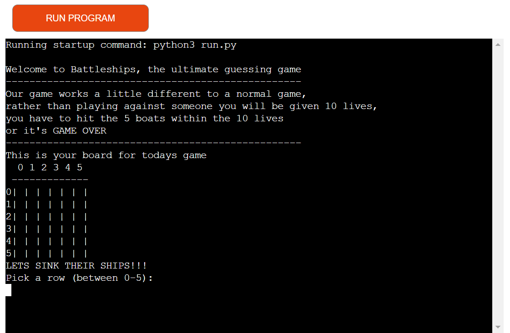

# Battleships

Link to deployed game is available at - [battleships game](https://battleships-game-2024-1746bf9acf31.herokuapp.com/)
## Introduction
Battle ships is a strategy guessing game, played on a grid that scores players based on how many targets they manage to guess the location of. Typically an online battleships game is played against either a computer or another player, but my version of battleships is played differen in which players are still given points depending on how many targets they hit but they are also given a set amount of lives. If they manage to hit all the targets within the set amount of lives they will win the game but if they don't, they will lose.
## Project
## Features
## Technologies Used
## Testing
## Deployment
## Credits
