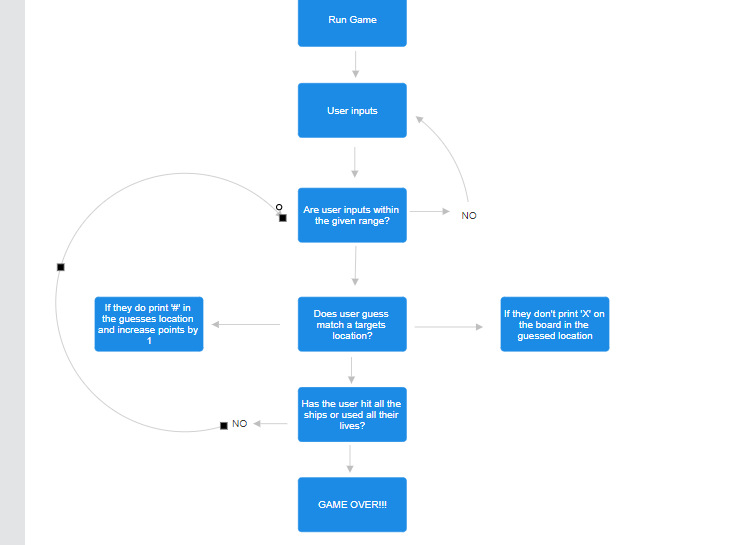

# Battleships

Link to deployed game is available at - [battleships game](https://battleships-game-2024-1746bf9acf31.herokuapp.com/)
## Introduction
Battle ships is a strategy guessing game, played on a grid that scores players based on how many targets they manage to guess the location of. Typically an online battleships game is played against either a computer or another player, but my version of battleships is played differen in which players are still given points depending on how many targets they hit but they are also given a set amount of lives. If they manage to hit all the targets within the set amount of lives they will win the game but if they don't, they will lose.
## Project
#### The aim of this project is to:
- produce a game that scores players on the targets they hit
- displays messages based on user inputs
- gives the player a set amount of lives and if they don't hit all the targets then ends the game
- displays certain symbols depending on if the player has hit or missed a target
- validates players inputs by cross referencing the inputs to the players grid

### User goals
- get a clear understanding of how the game works
- be able to enter a guess for both the row and column of the target 
- if the guess is invalid then be informed 
- be informed of when the game is over

### Pre Development
Before writing any code for the project I decided to create a flow chart to outline the general direction of the game and the steps necessary.

## Features
## Technologies Used
## Testing
## Deployment
## Credits
